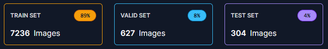
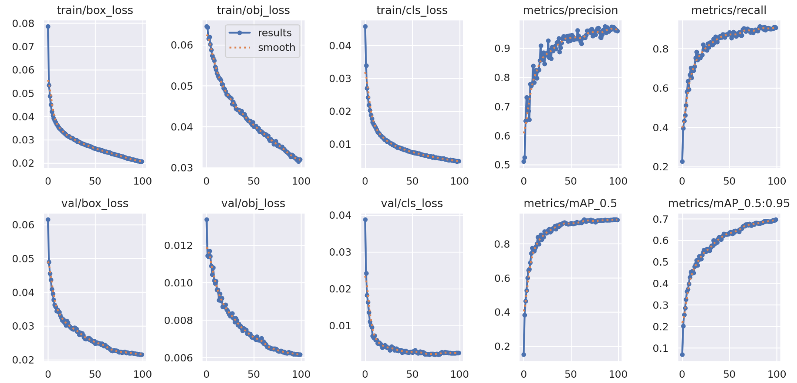

# GuardianEye

GuardianEye is a powerful tool that leverages advanced computer vision techniques to swiftly detect and alert against potential threats, ensuring safety and security with precision.

## Table of Contents

- [Installation](#installation)
- [Usage](#usage)
- [Documentation](#documentation)
    - [Performance Evaluation](#performance-evaluation)
    - [Training](#training)
- [License](#license)

## Installation

To install GuardianEye, follow these steps:

1. Clone the repository: `git clone https://github.com/AlienWolfX/WeaponDetection.git`
2. Navigate to the cloned directory: `cd WeaponDetection`
3. Install the required libraries: `pip install -r requirements.txt`

## Usage

To use GuardianEye, execute the following command: `python main.py`

## Documentation

### Performance Evaluation

GuardianEye's performance is evaluated based on the following metrics:

| Metric                | Value  |
|-----------------------|--------|
| Average Processing Time | 0.1146 seconds |
| Average CPU Usage     | 24.9%  |
| Average Memory Usage  | 76.4 Mb  |

### Training

The dataset used for training was annotated using Roboflow. The following image shows the split of the dataset:

The model's performance during training is visualized using a confusion matrix and various metrics:

#### Confusion Matrix

#### Metrics

## License

GuardianEye is licensed under the MIT License. You are free to use, copy, modify, merge, publish, distribute, sublicense, and/or sell copies of the Software, and to permit persons to whom the Software is furnished to do so, subject to the following conditions:

The above copyright notice and this permission notice shall be included in all copies or substantial portions of the Software.

THE SOFTWARE IS PROVIDED "AS IS", WITHOUT WARRANTY OF ANY KIND, EXPRESS OR IMPLIED, INCLUDING BUT NOT LIMITED TO THE WARRANTIES OF MERCHANTABILITY, FITNESS FOR A PARTICULAR PURPOSE AND NONINFRINGEMENT. IN NO EVENT SHALL THE AUTHORS OR COPYRIGHT HOLDERS BE LIABLE FOR ANY CLAIM, DAMAGES OR OTHER LIABILITY, WHETHER IN AN ACTION OF CONTRACT, TORT OR OTHERWISE, ARISING FROM, OUT OF OR IN CONNECTION WITH THE SOFTWARE OR THE USE OR OTHER DEALINGS IN THE SOFTWARE.